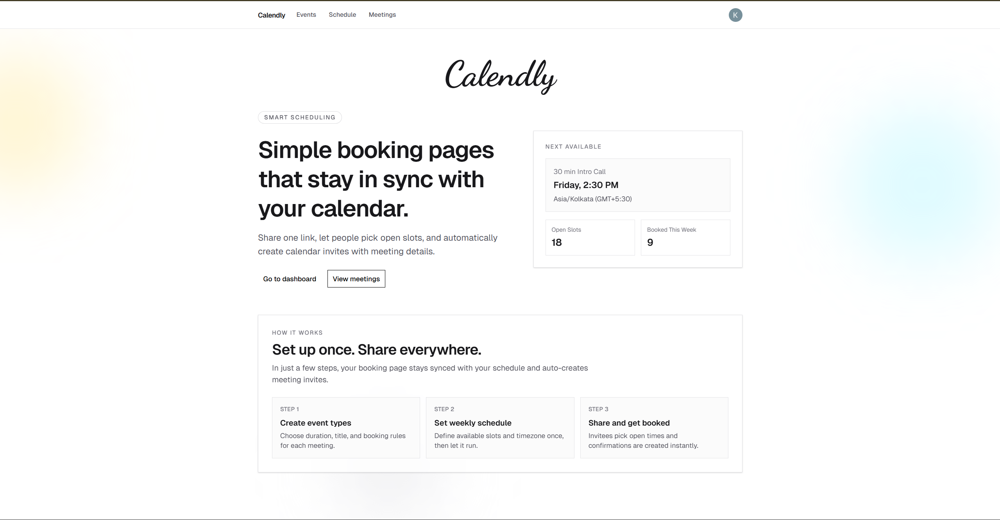

# Calendly Clone - Full Stack Scheduling App

A full-stack scheduling app inspired by Calendly, built with Next.js App Router.

## App Preview



Users can:
- Sign in and manage event types
- Define weekly availability and timezone
- Share public booking links
- Let invitees book slots with timezone support
- Auto-create Google Calendar events (with Meet link)
- View upcoming and past meetings
- Cancel meetings (removes both DB booking and Google Calendar event)

## Tech Stack

- Framework: Next.js 16 (App Router), React 19, TypeScript
- Styling/UI: Tailwind CSS v4, shadcn/ui, Radix UI, Lucide icons
- Auth: Clerk
- Database: PostgreSQL (Neon)
- ORM/Migrations: Drizzle ORM + Drizzle Kit
- Validation: Zod + React Hook Form
- Date/Timezone: date-fns + date-fns-tz
- External API: Google Calendar API (via googleapis)

## Key Features

- Private dashboard routes: events, schedule, meetings
- Mandatory public profile slug onboarding before using private features
- Event CRUD with per-user unique slug validation
- Public routes:
	- `/{username}`
	- `/{username}/{eventSlug}`
	- `/{username}/{eventSlug}/confirmation`
- Availability engine checks:
	- Saved weekly schedule
	- Existing confirmed bookings
	- Google Calendar busy intervals
- Booking race-condition protection (slot re-check + unique constraints)
- Google Meet conference link creation on event insert
- Meeting cancellation syncs Google Calendar first, then deletes DB booking

## Route Map

- Home: `/`
- Auth:
	- `/sign-in`
	- `/sign-up`
- Private:
	- `/events`
	- `/events/new`
	- `/events/[eventId]/edit`
	- `/schedule`
	- `/meetings`
- Public booking:
	- `/{username}`
	- `/{username}/{eventSlug}`
	- `/{username}/{eventSlug}/confirmation`

Middleware protection is applied to `/events(.*)`, `/schedule(.*)`, and `/meetings(.*)`.

## Data Model (Drizzle)

- `userPublicProfiles`: public slug per Clerk user
- `events`: event types (name, slug, duration, active flag)
- `schedules`: per-user schedule timezone
- `scheduleAvailabilities`: weekly slot definitions by day/start/end
- `bookings`: confirmed/cancelled bookings with invitee details and timestamps

Important constraints include:
- Unique event slug per user
- Unique host/event slot per status
- Start time must be before end time

## Google Calendar Integration

This app integrates Google Calendar in three ways:
- Read busy times to block unavailable slots
- Create calendar events (with Google Meet) when a booking is confirmed
- Delete linked calendar events when a meeting is cancelled

### OAuth Scopes Used (2 scopes)

1. `https://www.googleapis.com/auth/calendar.freebusy`
2. `https://www.googleapis.com/auth/calendar.events`

Why both:
- `calendar.freebusy` is used to read busy-time availability windows
- `calendar.events` is used to create and delete calendar events

### Important: Scope Approval + Test Emails

These are sensitive Google Calendar scopes. In development, when your OAuth consent screen is in `Testing` mode, only configured test users can authorize.

That is why we use test email accounts while developing.

If a user is not in test users, they can see errors such as access denied or incomplete permissions.

To configure test users:
- Google Cloud Console -> APIs & Services -> OAuth consent screen -> Test users
- Add the email addresses that should be allowed to authorize

For production, complete Google app verification for required scopes and publish the consent screen.

## Environment Variables

Create `.env.local` in project root:

```bash
# App
NEXT_PUBLIC_APP_URL=http://localhost:3000

# Database
DATABASE_URL=postgresql://...

# Clerk
NEXT_PUBLIC_CLERK_PUBLISHABLE_KEY=pk_...
CLERK_SECRET_KEY=sk_...

# Google OAuth (preferred names)
GOOGLE_OAUTH_CLIENT_ID=...
GOOGLE_OAUTH_CLIENT_SECRET=...
GOOGLE_OAUTH_REDIRECT_URL=...

# Legacy fallback names also supported by the code
# OAUTH_CLIENT_ID=...
# OAUTH_CLIENT_SECRET=...
# OAUTH_REDIRECT_URI=...
```

Notes:
- Clerk Google OAuth connection must be configured to return user Google OAuth access tokens.
- Redirect URL in Google Cloud and Clerk must match exactly.

## Local Setup

1. Install dependencies

```bash
npm install
```

2. Configure environment variables in `.env.local`

3. Push schema to database

```bash
npm run db:push
```

4. Start dev server

```bash
npm run dev
```

5. Open app

`http://localhost:3000`

## Available Scripts

- `npm run dev` - start local dev server
- `npm run build` - build production bundle
- `npm run start` - run production server
- `npm run lint` - run ESLint
- `npm run db:generate` - generate Drizzle migration files
- `npm run db:push` - push schema directly to DB
- `npm run db:migrate` - apply migrations
- `npm run db:studio` - open Drizzle Studio

## Booking Flow Summary

1. Host creates event and schedule
2. Invitee opens public event page
3. Available slots are computed from schedule + existing bookings + Google busy intervals
4. Invitee submits details
5. Server revalidates slot availability
6. Booking row is inserted
7. Google Calendar event is created
8. Invitee sees confirmation page

On cancellation:
- App finds matching Google event (bookingId metadata + fallback matching)
- Deletes Google event
- Deletes booking row
- Revalidates meetings page

## Troubleshooting

- `Google account is not connected for this user`
	- Reconnect Google in Clerk-authenticated account

- `Google Calendar permissions are incomplete`
	- Reauthorize and ensure both required scopes are granted

- `access_denied` or OAuth testing errors
	- Add that account as a Google OAuth test user

- `Missing Google OAuth environment variables`
	- Check `GOOGLE_OAUTH_CLIENT_ID`, `GOOGLE_OAUTH_CLIENT_SECRET`, `GOOGLE_OAUTH_REDIRECT_URL`

- Slots not showing
	- Verify schedule exists and timezone is valid
	- Confirm host has at least one active event and valid availability

## Project Structure

```text
app/                    # App Router pages/layouts
components/             # UI and feature components
db/                     # Drizzle schema, db client, migrations
lib/                    # Business logic (availability, calendar, validation)
public/                 # Static assets
proxy.ts                # Clerk middleware route protection
```

## Notes

- Default schedule is auto-created for weekdays (09:00-17:00) if missing.
- Default timezone fallback in scheduling defaults is `Asia/Kolkata`.
- Availability checks degrade gracefully if Google busy-check calls fail (schedule + existing bookings still apply).
